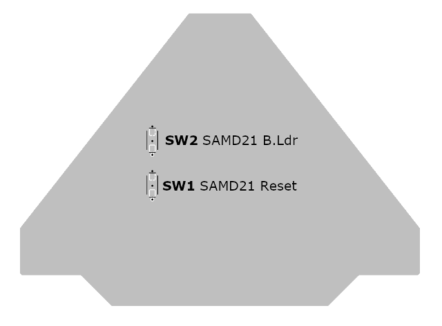
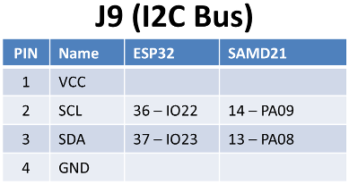
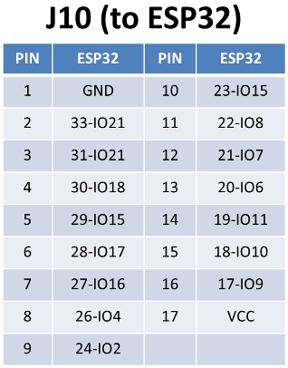
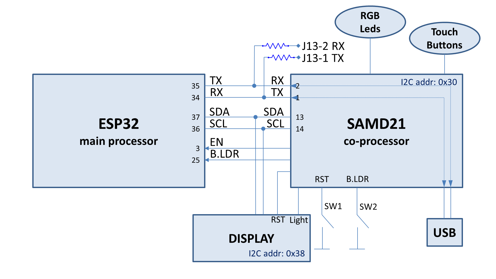

# About

This is the unofficial firmware that can be loaded on the co-processor
(the Atmel SAMD21G16B) of the
[Hacktivity 2019 badge](https://hacktivity.com/index.php/badge/) and
that will permit to use the Arduino IDE environment to program it,
instead of the MicroPython of the original firmware.

This project has been forked from the
[Disobey 2019 badge](https://github.com/badgeteam/disobey-2019-samd-firmware)
firmware project. The Hacktivity and the Disobey 2019 badges have very
different shapes, but their circuits are very similar, but not
identical.

The main differences between this firmware and the original Disobey
2019 firmware are:

- minor differences in managing the LEDs on the board, due to slightly
  different circuits;

- increased the USB/UART buffer size from 64 bytes to 1024 bytes, to
  prevent dropping bytes during serial communication at 115200 bps;

- the serial bridge (from USB/UART to ESP32 Uart interface) has been
  rewritten to be non-blocking and to use a small buffer, to prevent
  dropping bytes during serial transmission.

These modifications allow to use the Arduino IDE to program the ESP32,
that is the main processor on this board.

# Warning

Loading this alternative and unofficial firmware on the badge will
destroy the current firmware. You will not be able to rollback this
modification unless you save the original firmware first (can be
complicated to do and requires additional equipments).

# The Hacktivity 2019 badge

This badge was distributed at the Hacktivity 2019 Security Conference
attendee, it is based on the popular ESP32 processor by Espressif and
includes an ARM-based chip, the Atmel ATSAMD21G16B co-processor, that
manages the USB serial connection, the touch buttons, and the LEDs on
the board. The co-processor communicates with the main ESP32 processor
trough the I2C bus.

## Top View


## Bottom View


## Top View Pinout


## Bottom View Switches



## Badge Pinout






## Block Diagram



# How do I compile this firmware?

A pre-compiled firmware is included in this repository, in the
firmware folder there is the
[firmware.ino.hacktivity.bin](./firmware/firmware.ino.hacktivity.bin)
file.

To re-compile it:

1. install version 1.6.18 of the "Arduino SAMD boards" board support
   package using the Arduino boards manager;

2. navigate to "~/.arduino15/packages/arduino/hardware/samd" (on
   Linux; on Windows or Mac you have to navigate on a similar folder);

3. replace the "1.6.18" folder with the folder found in the
   "arduino-board-support.zip" archive;

4. in the Arduino IDE, select "Tools -> Board -> Arduino SAMD ..->
   Disobey Badge 2019";

5. open "firmware.ino" with the Arduino IDE and click "Sketch > Export
   compiled binary";

6. in the Arduino IDE logging window, locate where the compiled binary
   has been created (something similar to
   "/tmp/arduino\_build\_nnnnnn\_/firmware.ino.bin")


# How do I flash the binary to my board?

0. **Do not use the Arduino IDE to load the firmware!** It will be used to
   load the firmware on the ESP32 main processor.

1. Install the [dfu-util](http://dfu-util.sourceforge.net/) software
   on your PC. Available for Linux, Windows, and Mac.

2. Solder on SW1 and SW2 if you did not do that already. Alternatively
   you can use a couple of jumper wires to achieve a similar result.

3. Connect a USB cable to your board and your PC.

4. Then hold SW2 (the SAMD bootloader trigger pin) while pressing
   shortly on SW1 (the SAMD reset pin).  This will place the SAMD into
   download mode.

5. Then execute a command similar to the following (adjust the binary
   file name if needed):

   ```
   sudo dfu-util -D ./firmware/firmware.ino.hacktivity.bin -R
   ```

# How do I use it?

The firmware allows for connecting to the serial port of the ESP32 at
115200 baud and can be used with the Arduino IDE to program the ESP32.

To do so it is needed to manually select the ESP32 in the Arduino IDE:
"Tools -> Board -> ESP32 Arduino -> ESP32 Dev Module".

If the "ESP32 Arduino" menu item is not available you have to install
support for ESP32 based boards using the Board Manager.

The ESP32 can access the touch buttons, LEDs, speaker, and battery
voltage readings over I2C.

# The I2C protocol

The SAMD21 co-processor talks to the ESP32 main processor through the
I2C serial buffer (see the above block diagram).

The co-processor I2C address is 0x30.

To exchange information there is a simple protocol: the ESP32
processor starts the data exchange and can send commands (to switch on
some LEDs, or activate the buzzer) or can read the status of the
SAMD21 (touch button status and battery status).

## All LEDs Off

The ESP32 sends the command byte 0x04 and the SAMD21 will switch off
all LEDs.

Example of an Arduino function, running on the ESP32, to switch all
LEDs off:

```
bool SAMD::ledsOff(void) {
  uint8_t c = 0x04;
  uint8_t error;
  Wire.beginTransmission(addr);
  Wire.write(c);
  error = Wire.endTransmission();
  return (error == 0);
}
```

## Set the Display Backlight On or Off

The ESP32 sends the command byte 0x02 followed by the data byte ("0"
to switch the backlight off, "1" to switch on).

Example of an Arduino function, running on the ESP32, to switch the
display backlight on or off according the value of "blstatus":

```
bool SAMD::setBl(uint8_t blstatus) {
  uint8_t c = 0x02;
  uint8_t error;
  Wire.beginTransmission(addr);
  Wire.write(c);
  Wire.write(blstatus);
  error = Wire.endTransmission();
  return (error == 0);
}
```

## Switch on or off an RGB LED

The ESP32 sends the command byte 0x01 followed by 4 data bytes:

1. id: the id of the LED (from 0 to 5);

2. r: the red intensity value: 0 switch off the red color, 1 maximum
   red intensity, 255 minimum red intensity;

3. g: the green intensity value: 0 switch off the green color, 1
   maximum green intensity, 255 minimum green intensity;

4. b: the blue intensity value: 0 switch off the blue color, 1 maximum
   blue intensity, 255 minimum blue intensity;


Example of an Arduino function, running on the ESP32 drive a LED:

```
bool SAMD::setLed(uint8_t id, uint8_t r, uint8_t g, uint8_t b) {
  uint8_t c = 0x01;
  uint8_t error;
  Wire.beginTransmission(addr);
  Wire.write(c);
  Wire.write(id);
  Wire.write(r);
  Wire.write(g);
  Wire.write(b);
  error = Wire.endTransmission();
  return (error == 0);
}
```

## Play a tone on the speaker

The ESP32 sends the command byte 0x03 followed by 4 data bytes:

1. most significant byte of the frequency (a 2-byte integer);

2. least significant byte of the frequency

3. most significant byte of the duration in milliseconds

4. least significant byte of the duration in milliseconds

Example of an Arduino function, running on the ESP32 to play a tone on
the speaker:

```
bool SAMD::buzz(uint16_t freq, uint16_t time) {
  uint8_t c = 0x03;
  uint8_t fh = highByte(freq);
  uint8_t fl = lowByte(freq);
  uint8_t dh = highByte(time);
  uint8_t dl = lowByte(time);;
  uint8_t error;
  Wire.beginTransmission(addr);
  Wire.write(c);
  Wire.write(fh);
  Wire.write(fl);
  Wire.write(dh);
  Wire.write(dl);
  error = Wire.endTransmission();
  return (error == 0);
}
```

## Read the SAMD21 status

The ESP32 reads two status bytes from the SAMD21; On the first byte
each bit, from the least significant, is set to indicate:

0. touch button "ENTER" is pressed

1. touch button "LEFT" is pressed

2. touch button "RIGHT" is pressed

3. touch button "EXIT" is pressed

4. touch button "DOWN" is pressed

5. touch button "UP" is pressed

Other bits and the other byte has not been investigated yet.

Example of an Arduino function, running on the ESP32 to read the
SAMD21 status:

```
void SAMD::updateStatus(void) {
  Wire.requestFrom(addr,2);
  prevc1=c1;
  prevc2=c2;
  c1=Wire.read();
  c2=Wire.read();
}
```


# More information

* [The Hacktivity 2019 Badge](https://hacktivity.com/index.php/badge/)

* [Hello World on the ESP32 for the Hacktivity Badge](https://github.com/digiampietro/hacktivity-2019-esp32-hello-world),
  it includes library files to use the Display and to interact with
  the SAMD21 co-processor

* [The GitHub repository for the Disobey 2019 badge](https://github.com/disobeyfi/badge-2019)

* [The GitHub repository for the Disobey 2019 SAMD firmware](https://github.com/badgeteam/disobey-2019-samd-firmware). This
  project was forked from this repository

* [Atmel SAMD21 family Data Sheet](https://cdn.sparkfun.com/datasheets/Dev/Arduino/Boards/Atmel-42181-SAM-D21_Datasheet.pdf)

* [Espressif ESP32-WROOM-32 Data Sheet](https://www.espressif.com/sites/default/files/documentation/esp32-wroom-32_datasheet_en.pdf)

* [ERC12864-10 Data Sheet (the display)](http://www.buydisplay.com/download/manual/ERC12864-10_Series_Datasheet.pdf)

* [LM6059BCW Data Sheet (the chip driving the Display)](https://www.topwaydisplay.com/sites/default/files/2020-02/LM6059BCW.pdf)


# License and authors

The firmware in this repository was originally written for Disobey.fi by Kliment and patched up a bit by Renze.

It was patched by Valerio Di Giampietro for the Hacktivity 2019 badge (unofficial firmware), and to use this badge with the Arduino IDE, instead of microPython.

Copyright 2019 badge.team

Copyright 2020 Valerio Di Giampietro

All code found in the firmware folder in this repository is licensed under the Apache license,
as found below.

Our dependencies remain licensed under their respective original licenses.

This project contains the following differently licensed files:

The Arduino board support files (the arduino-board-support.zip archive)
The SAMD bootloader by Alex Taradov and Peter Lawrence
