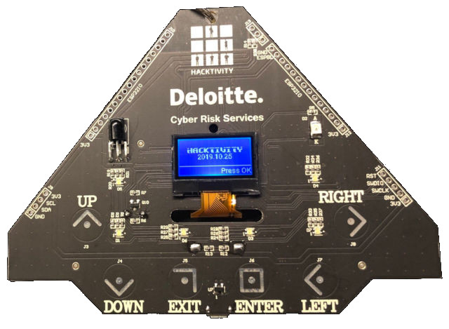
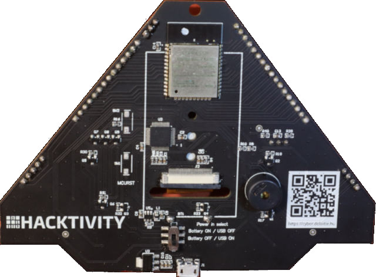

# About

This is the unofficial firmware that can be loaded on the co-processor
(the Atmel SAMD21G16B) of the
[Hacktivity 2019 badge](https://hacktivity.com/index.php/badge/) and
that will permit to use the Arduino IDE and environment to program it,
instead of the MicroPython of the original firmware.

This project has been forked from the
[Disobey 2019 badge](https://github.com/badgeteam/disobey-2019-samd-firmware)
firmware project. The Hactivity and the Disobey 2019 badges have very
different shapes, but their circuits are very similar, but not
identical.

The main differences between this firmware and the original Disobey
2019 firmware are:

- minor differences in managing the leds on the board, due to slightly
  different circuits;

- increased the USB/UART buffer size from 64 bytes to 1024 bytes, to
  prevent dropping bytes during serial transmission at 115200 bps;

- the serial brdige (from USB/UART to ESP32 Uart interface) has been
  rewritten to be non blocking and to use a small buffer, to prevent
  dropping bytes during serial transmission.

These modifications allow to use the Arduino IDE to program the ESP32,
that is the main processor on this board.

# Warning

Loading this alternative and unofficial firmware on the badge will
destroy the current, MicroPython based, firmware. You will not be able
to rollback this modification, unless you save the original firmware
first (can be complicated to do and requires additional equipments).

# The Hacktivity 2019 badge

This badge was distributed at the Hacktivity 2019 Security Conference attendee:

## Top View



## Bottom View



## Top View Pinout


## Bottom View Switches


## Pinout Description

### J9 Connector


### J10 Connector


# What is this?
This is the firmware running on the SAMD co-processor found on the Disobey 2019 badge

# How do I compile this firmware?
First install version 1.6.18 of the "Arduino SAMD boards" board support package using the Arduino boards manager.
Then navigate to ~/.arduino15/packages/arduino/hardware/samd and replace the 1.6.18 folder with the folder found in the "arduino-board-support.zip" archive.

Then open "firmware.ino" with the Arduino IDE and click Sketch > Export compiled binary

# How do I flash the binary to my board?
First solder on SW1 and SW2 if you did not do that already.
Then hold SW2 (the SAMD bootloader trigger pin) while pressing shortly on SW1 (the SAMD reset pin).
This will place the SAMD into download mode.

Then execute the following command:

```
sudo dfu-util -D firmware.ino.disobey.bin -R
```

# How do I use it?

The firmware allows for connecting to the serial port of the ESP32 at 115200 baud.

The ESP32 can access the touch buttons, LEDs, speaker and battery voltage readings over I2C.

# The I2C protocol


# More information
[The github repository for the Disobey 2019 badge](https://github.com/disobeyfi/badge-2019)

# License and authors

The firmware in this repository was originally written for Disobey.fi by Kliment and patched up a bit by Renze.

It was patched by Valerio Di Giampietro for the Hacktivity 2019 badge (unofficial firmware), and to use this badge with the Arduino IDE, instead of microPython.

Copyright 2019 badge.team

Copyright 2020 Valerio Di Giampietro

All code found in the firmware folder in this repository is licensed under the Apache license,
as found below.

Our dependencies remain licensed under their respective original licenses.

This project contains the following differently licensed files:

The Arduino board support files (the arduino-board-support.zip archive)
The SAMD bootloader by Alex Taradov and Peter Lawrence
